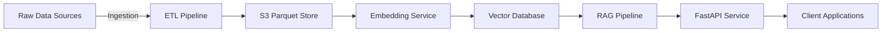

# Quorum Staff AI Engineer Showcase: Architecture & Design Decisions

This document outlines the high-level architecture, component interactions, and design rationales for the GenAI-driven public affairs platform showcased in this repository.

---

## 1. System Overview

* **Raw Data Sources**: PDFs, CSVs, RSS feeds, APIs containing legislative text, policy docs, social media.
* **ETL Pipeline** (`data_ingestion.py`): Extract → Chunk → Parquet → S3.
* **Embedding Service**: AWS SageMaker endpoint serving embedding models (or local SentenceTransformer).
* **Vector Database**: Qdrant or OpenSearch storing embeddings and payloads.
* **RAG Pipeline** (`rag_pipeline.py`): Retrieves relevant chunks and generates answers via an LLM.
* **FastAPI Service** (`sem_search.py`, `api_server.py`): Exposes `/search` and `/summarize` endpoints.
* **Client Applications**: Internal UIs (e.g., Quorum Copilot), dashboards, or integrations.

---

## 2. Component Interactions & Data Flow

1. **Data Ingestion**

   * Ingests raw data from local or remote sources.
   * Uses **Parquet** for efficient columnar storage on S3.
   * Applies **text chunking** with overlaps for context preservation.
   * Metadata stored in **DynamoDB** for tracking ingestion status and TTLs.

2. **Embeddings Generation**

   * **SentenceTransformer** (local) or **SageMaker** (production) generates fixed-size embeddings.
   * Embeddings pushed into **Qdrant** (default) or **OpenSearch**, configured via `VectorStore`.

3. **Retrieval & Generation (RAG)**

   * **Retrieval**: `VectorStore.search()` returns top-k chunks by cosine similarity.
   * **Augmented Generation**: LangChain's `RetrievalQA` uses retrieved context and a custom **PromptTemplate** to query an LLM (e.g., `gpt-3.5-turbo`).
   * Results include the answer plus source chunks for transparency.

4. **API Layer**

   * **FastAPI** endpoints for **search** and **summarization**.
   * Consumes `RAGPipeline` and `VectorStore` under the hood.
   * CORS and health-check ready for microservice orchestration.

5. **Infrastructure as Code**

   * **Terraform** provisions S3, DynamoDB, IAM roles, Lambda functions, and SageMaker endpoints.
   * **Docker** encapsulates service dependencies for local and production deploys.
   * **CI/CD** (GitHub Actions) runs lint, tests, and `terraform plan` on each PR.

---

## 3. Key Design Decisions

| Aspect                    | Decision & Rationale                                                                   |
| ------------------------- | -------------------------------------------------------------------------------------- |
| **Chunking Strategy**     | 10,000-character chunks with 200-character overlap balances context vs. # of chunks.   |
| **Parquet + S3**          | Columnar storage offers fast reads for batch embedding and lower storage costs.        |
| **Vector DB Abstraction** | Unified interface allows switching between Qdrant and OpenSearch without code changes. |
| **LangChain for RAG**     | Battle-tested framework with modular chains and prompt customization.                  |
| **Prompt Engineering**    | Custom template frames the LLM as a legislative AI assistant for domain alignment.     |
| **Infrastructure IaC**    | Terraform ensures reproducibility and versioning of cloud resources.                   |
| **Testing Strategy**      | Unit tests for each module, integration tests via dummy clients, CI enforcement.       |

---

## 4. Scalability & Reliability

* **Auto-scaling**: SageMaker endpoint can be configured with multiple instances.
* **Fault Tolerance**: S3 lifecycle and DynamoDB TTL ensure data hygiene.
* **Monitoring**: CloudWatch for Lambda, SageMaker, and API metrics.
* **Cost Optimization**: Lifecycle expiration on S3, pay-per-request DynamoDB.

---

## 5. Security Considerations

* **IAM Roles**: Least-privilege policies for Lambda and SageMaker.
* **Encryption**: S3 buckets enforce encryption at rest; HTTPS only.
* **Secrets Management**: Environment variables and AWS Secrets Manager for API keys.

---

> *For further details or adjustments, see individual module docstrings and the Terraform comments in `infra/terraform/`.*
